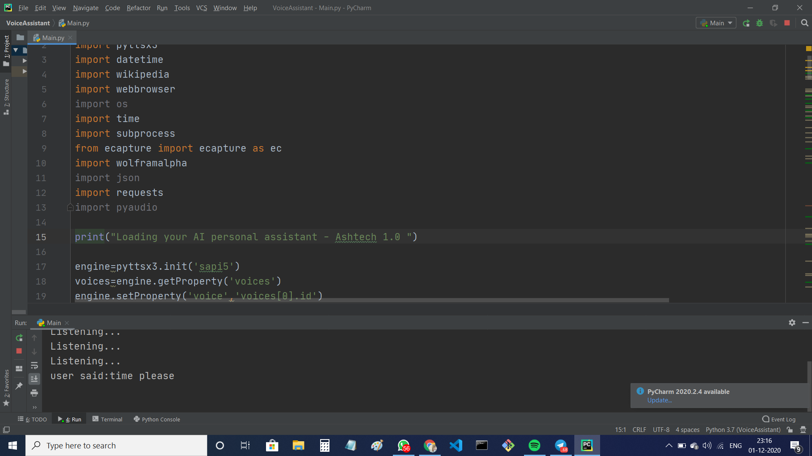

# Ashtech-Personal-AI-Voice-Assistant.
## Introduction
A voice assistant is a digital assistant that uses voice recognition, speech synthesis, and natural language processing (NLP) to provide a service through a particular application.

## Features in AshTech
 AshTech is a Personal Artificial Intelligence voice assistant used to predict the basic functions like, 
- Searching 🔎 
- Opening websites like Wikipedia, Stack Overflow, Github etc. 👨‍💻
- Capturing images. 📸 
- Predicts time, date, weather report etc.💡🔎

## Demo video
- [AshTech 2.0 - AI Personal Voice Assistant](https://www.youtube.com/watch?v=BArmz8vtHB8)

## :handshake: Contribution guidelines 
Follow these algorithms to contribute to the AshTech repository 📝
- Fork this repository 
- Select your comfortable issues given in issues feature [click here to see the issues](https://github.com/Ash515/AshTech-AI_Personal_Voice_Assistant./issues).
- Try to solve the mentioned issues and make a pull request by using branch folder 🌿 .
- Stricly maintain the clear commit name and message.
- Strictly maintain the decorum of this repository ❤

### Note  
Feel free to file a new issue with a respective title and description on the **AshTech- AI Personal Voice Assistant**.  If you already found a solution to your problem, I would love to review your pull request! 💚🤎

## :key: Prerequisites
- You should install python version 3.7
- import all modules required for the project using this command
```
pip install <module name>
```

# 🚀&nbsp;Installation 
1. Clone the repository 
```
https://github.com/Ash515/AshTech-AI_Personal_Voice_Assistant..git
```
2. Check the status of your file 
```
$git status
```

3.For using VScode for editing your files 
```
$git code .
```
4. To directly add your files to github
```
$git add .
```
5. After writing your code commit your changes 
```
$git commit -m  <message>
```
6. To pull your code to reposoitory
```
$git push origin master
```
Thats all about installation and version control with **Git**

## :key: Result 



## :clap: And it's done!
Feel free to mail me for any doubts/query 
:email: theyoungtech515@gmail.com

## :heart: Owner
Made with :heart:&nbsp;  by [Ashwin Kumar R](https://github.com/Ash515)

## :eyes: License
MIT © [Ashwin Kumar R](https://github.com/chandrikadeb7/Face-Mask-Detection/blob/master/LICENSE)

