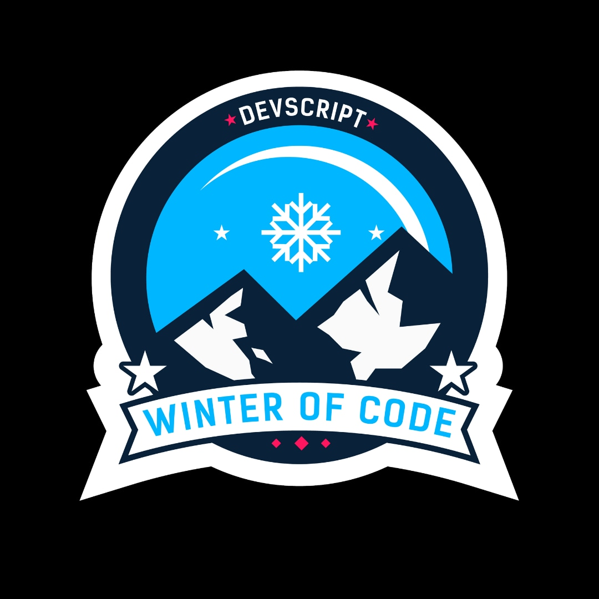

# Ashtech-Personal AI Voice Assistant. 


## 🔎  Introduction
A voice assistant is a digital assistant that uses voice recognition, speech synthesis, and natural language processing (NLP) to provide a service through a particular application.

## :heart: Features in AshTech
 AshTech is a Personal Artificial Intelligence voice assistant used to predict the basic functions like, 
- Searching 🔎 
- Opening websites like Wikipedia, Stack Overflow, Github etc. 👨‍💻
- Capturing images. 📸 
- Predicts time, date, weather report etc. 💡🔎
- Search Videos on [Youtube](https://www.youtube.com/) :mag:
- Open any Operating System files like MS-Word, MS-Excel, Notepad, etc :desktop_computer:
- Say Jokes :grin:
- Help in Shopping :shopping_cart:
- Find out Jobs :briefcase:
- Search [Wikipedia](https://www.wikipedia.org/) :mag:
- Find Courses :notebook_with_decorative_cover::closed_book:
- Track COVID-19 :medical_symbol:
- Password Protected :closed_lock_with_key:


## 🌟 Tech Stacks
**Python 3.7**

## :hourglass: Project Demo
- [AshTech 2.0 - AI Personal Voice Assistant](https://www.youtube.com/watch?v=BArmz8vtHB8)

## :handshake: Contribution guidelines 
Follow these algorithms to contribute to the AshTech repository 📝
- Fork this repository 
- Select your comfortable issues given in issues feature [click here to see the issues](https://github.com/Ash515/AshTech-AI_Personal_Voice_Assistant/issues).
- Read the [Code of Conduct](https://github.com/Ash515/AshTech-AI_Personal_Voice_Assistant/blob/master/CODE_OF_CONDUCT.md) .
- Try to solve the mentioned issues and make a pull request by using branch folder 🌿 .
- Stricly maintain the clear commit name and message.
- Strictly maintain the decorum of this repository ❤

### 📌Note  
Feel free to file a new issue with a respective title and description on the **AshTech- AI Personal Voice Assistant**.  If you already found a solution to your problem, I would love to review your pull request! 💚🤎

## :key: Prerequisites
- You should install python version 3.7
- import all modules required for the project using this command
```
pip install <module name>
```

# 🚀&nbsp;Installation 
1. Clone the repository 
```
https://github.com/Ash515/AshTech-AI_Personal_Voice_Assistant.git
```
2. Check the status of your file 
```
$git status
```

3.For using VScode for editing your files 
```
$git code .
```
4. To directly add your files to github
```
$git add .
```
5. After writing your code commit your changes 
```
$git commit -m  <message>
```
6. To pull your code to reposoitory
```
$git push origin master
```
Thats all about installation and version control with **Git**

## :key: Result 


## Contribution Programmes




## Slack Channel for CWOC 2021
[Cwoc 21 | Ashtech personal voice assistant]( https://join.slack.com/t/cwoc21ashtech-6kh1974/shared_invite/zt-m07g8uuu-bRwsytfw0Hfqtq9BHC75qQ)

## :clap: And it's done!
Feel free to mail me for any doubts/query 
:email: theyoungtech515@gmail.com

## ❤️ Project Admin
<table>
	<tr>
		<td align="center">
			<a href="https://github.com/Ash515"> 
				<br /> <sub><b>Ash515</b></sub> </a>
			<br /> <a href="https://github.com/Ash515/AshTech-AI_Personal_Voice_Assistant/commits?author=Ash515">
                👑 Author
            </a> 
		</td>
	</tr>
</table>

## 🌟 Contributors
Thanks goes to these wonderful people ✨✨:
<table>
	<tr>
            <td>
		<a href="https://github.com/Ash515/AshTech-AI_Personal_Voice_Assistant/graphs/contributors">
  			
		</a>
	    </td>
	</tr>
</table>


## :eyes: License
MIT © [Ashwin Kumar R](https://github.com/Ash515/AshTech-AI_Personal_Voice_Assistant./blob/master/LICENSE)

